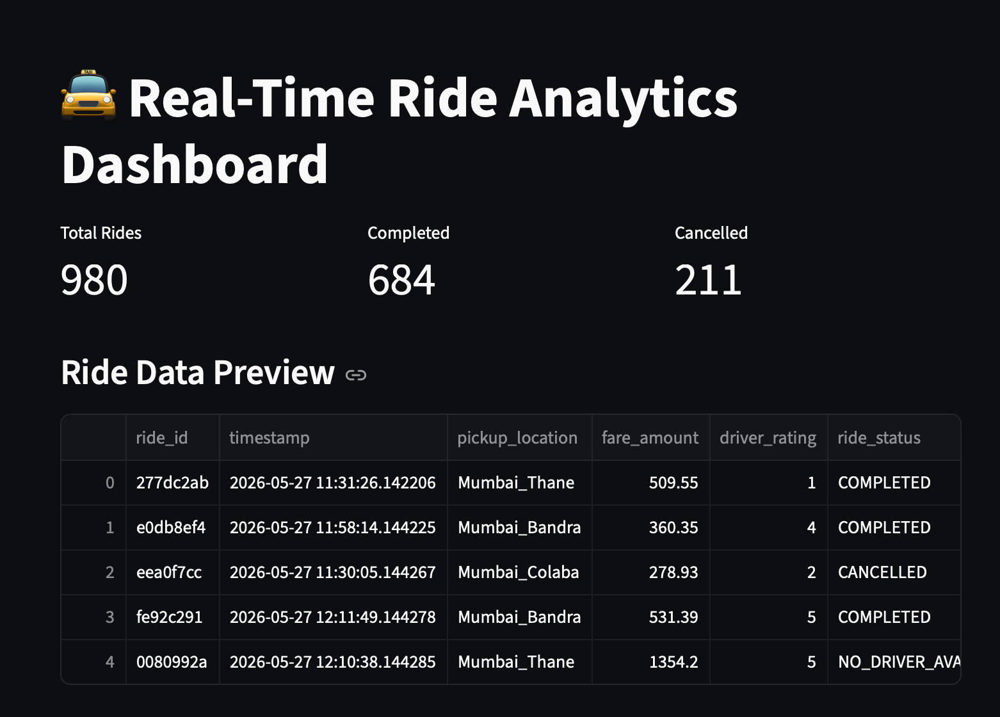
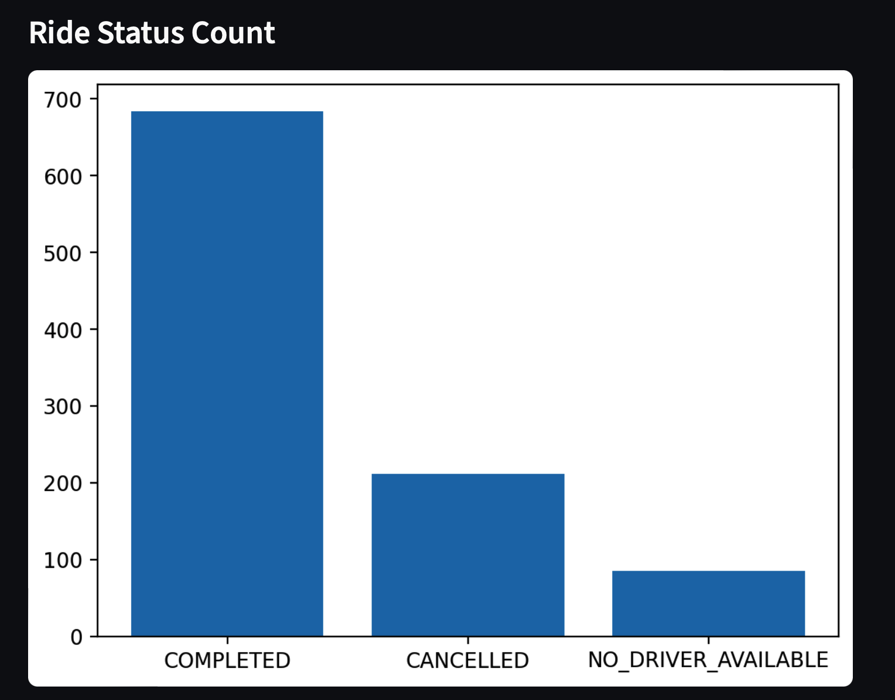
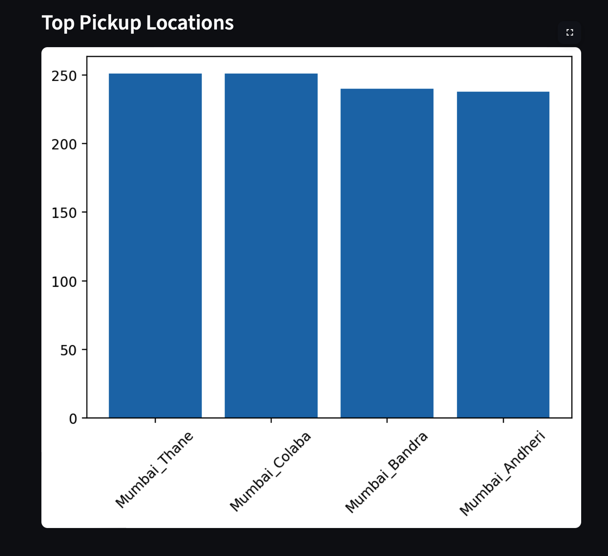

# Real-Time Ride Analytics & Surge Pricing Pipeline

## Project Overview

Real-Time Ride Analytics & Surge Pricing Pipeline is an end-to-end Data Analytics and Data Engineering project that simulates a ride-hailing platform similar to Uber. The project focuses on ride data generation, data cleaning, analytics processing, and business intelligence reporting to derive meaningful insights from ride transactions.

The system demonstrates how real-time ride data can be transformed into actionable business insights using Python, SQL, and analytics workflows commonly used in transportation and mobility platforms.

---

## Business Objectives

* Analyze ride demand across multiple locations.
* Track ride completion and cancellation patterns.
* Process and clean ride transaction data.
* Generate operational analytics and business reports.
* Support data-driven decision-making through insights.
* Simulate surge pricing and ride-demand analytics.

---

## Technology Stack

* Python
* Pandas
* NumPy
* SQL
* PostgreSQL
* Streamlit
* Matplotlib
* Git & GitHub

---

## Key Features

### Real-Time Ride Data Simulation

* Generates realistic ride transaction records.
* Simulates ride bookings across multiple locations.

### Data Processing Pipeline

* Cleans and validates ride data.
* Handles missing values and inconsistencies.
* Prepares datasets for analytics.

### Ride Analytics

* Tracks ride demand trends.
* Analyzes ride status distribution.
* Evaluates operational performance.

### Interactive Dashboard

* Displays ride KPIs and business metrics.
* Provides visual insights through charts and reports.
* Enables quick analysis of ride operations.

---

## Analytics Performed

### Ride Demand Analysis

* Evaluated ride requests across locations.
* Identified peak ride demand areas.

### Ride Status Analysis

* Compared completed, cancelled, and unavailable rides.
* Measured operational efficiency.

### Location Analysis

* Identified top pickup locations.
* Analyzed ride distribution across regions.

### Data Quality Analysis

* Cleaned and validated ride transaction records.
* Processed missing and inconsistent data.

---

## Dashboard Preview

### Main Dashboard



### Ride Status Analysis



### Top Pickup Locations



---

## Key Dashboard Metrics

* Total Rides: 980
* Completed Rides: 684
* Cancelled Rides: 211
* Multiple pickup locations analyzed
* Real-time operational insights

---

## Project Structure

```text
ride-analytics-surge-pipeline/
│
├── config/
│
├── data_generator/
│   └── mock_stream.py
│
├── pipeline/
│   └── clean_engine.py
│
├── analytics/
│
├── dashboard.py
│
├── dashboard_overview.png
├── ride_status_chart.png
├── pickup_locations_chart.png
│
└── README.md
```

---

## How to Run

### 1. Clone the Repository

```bash
git clone https://github.com/Aap2605/ride-analytics-surge-pipeline.git
cd ride-analytics-surge-pipeline
```

### 2. Install Dependencies

```bash
pip install pandas numpy streamlit matplotlib
```

### 3. Generate Ride Data

```bash
python3 data_generator/mock_stream.py
```

### 4. Run Data Processing Pipeline

```bash
python3 pipeline/clean_engine.py
```

### 5. Launch Dashboard

```bash
streamlit run dashboard.py
```

### 6. View Analytics

The dashboard provides:

* Ride Status Analysis
* Top Pickup Locations
* Ride Data Preview
* Operational Metrics
* Business Performance Insights

---

## Business Insights

* Completed rides account for the majority of ride requests.
* Cancellation patterns help identify operational challenges.
* Location-wise demand analysis supports resource planning.
* Analytics-driven insights improve operational efficiency and decision-making.

---

## Future Enhancements

* Real-time streaming integration
* Demand forecasting using Machine Learning
* Advanced surge pricing models
* Interactive business dashboards
* Cloud deployment and monitoring

---

## Author

Akansha Pandey

B.Sc. Computer Science

Data Analyst | SQL | Python | Power BI

GitHub: https://github.com/Aap2605
